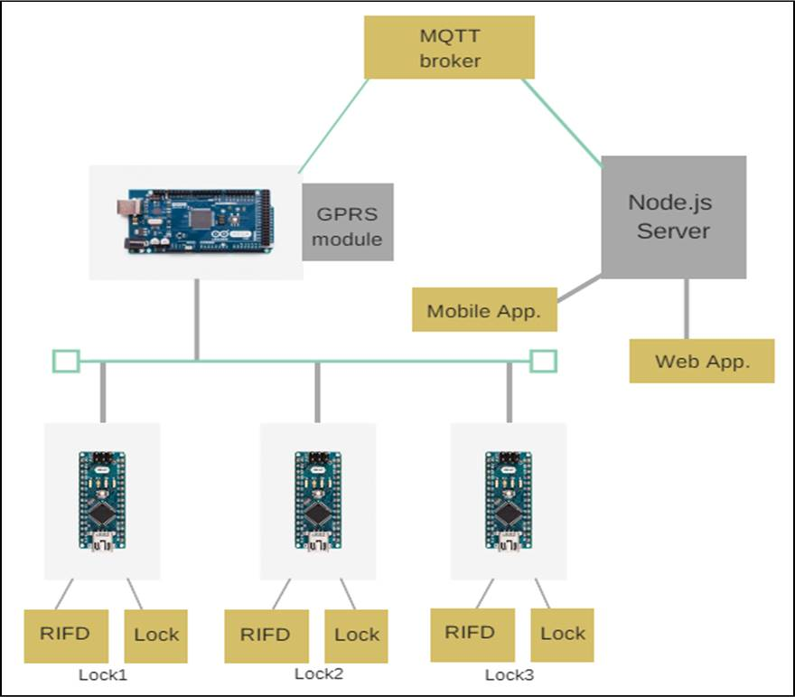

[comment]: # "This is the standard layout for the project, but you can clean this and use your own template"

# Automated Bike Sharing System

---

## Team
-  E/14/154, JAYASUNDARA J.M.S.M., [e14154@eng.pdn.ac.lk](mailto:e14154@eng.pdn.ac.lk)
-  E/14/141, IHALAGEDARA I.P.S.B., [e14141@eng.pdn.ac.lk](mailto:e14141@eng.pdn.ac.lk)
-  E/14/194, LOKUGE S.D., [e14194@eng.pdn.ac.lk](mailto:e14194@eng.pdn.ac.lk)

## Table of Contents
1. [Introduction](#introduction)
2. [Solution Architecture](#solution-architecture )
3. [Hardware & Software Designs](#hardware-and-software-designs)
4. [Links](#links)

---

## Introduction

As the most of the universities have wide area of land, transportation within the university causes time waste, accidents, congestion because of using the private vehicles, parking problems and the energy consumption related to the mobility of workers and students of the universities. The bicycle sharing programs have received increasing attention in recent years with initiatives to increase bike usage,better meet the demand of a more mobile public and lessen the environmental impacts of our transportation activities. So the project aims to introduce automated bike sharing system to minimize above impacts while evaluating the mobility patterns of academic campuses and assessing the energy consumption and pollutant emissions produced by the universities. This system provides the users to unlock the  chosen bicycle in the substations via a mobile app and start riding, check the availability of bicycles and authorized people to track the path of rides of all users.  
 

Due to the time limitation we are focusing only on smart locking system of bicycles and the mobile application.  
  

As this project is a Unified Project, the three aspects related to each subjects are as follows.

 

- CO321 : In the substations, the bicycles are locked using a smart lock and the rider have to unlock the chosen bicycle through a mobile app. Here we are using a QR code to open the each lock through the mobile app.  
  
- CO324 : Each docks are considered as a node and they are connected to a another node placed in sub stations.Those nodes in the substation are connected to a centralized node. Each locks in the docks are controlled by the central server. The details of the each users are monitored at the central node. The locations of the bicycles are getting using the mobile app.  
  
- CO325 : The details and data about each rider and the bicycle are sent through the system as encrypted data.  

#### [Intro Video](https://youtu.be/MeGC7iFCWVc)

## Solution Architecture

### Embedded System Designing
 

 1. Measuring and Controlling  
    - RFID reader and tags/stickers - To identify each bicycle is in the exact position and to identify the bicycle when returning to the dock station.

    - Electric lock - To lock the bicycle

 
2. Embedded Platform

    - Arduino: Arduino  is an open source computer hardware and software platform which is very easy to use. There are enough libraries and compatible modules which can connect to the arduino board. For serial communication we can have hardware serial ports or software serial ports. To control the locking mechanism there are digital I/O pins and ICSP pins.

 
3. Connecting the system to the network

 
    - Whole locking system will connect to internet using a GSM module

    - Users will connect to the system using a Mobile App

 

4. Peripheral devices

 

    - RFID reader - used to read the RFID stickers in the bicycle. These stickers have a unique id which we use as the identification of bicycle. It is a 5V device, so you don’t need a external power source. ICSP pins are going to use for the communication between the reader and the arduino board.

 

    - GSM module - used to connect with central server. TTL pins in GSM module will use to connect the module to Arduino board.

 

    - A linear actuator - used in locking mechanism of the bikes. Digital I/O pins will be used to send control signals to the actuator.

 

5. Limitations of peripheral devices

 

    - There are various security problems with locking mechanism. Additional sensors have to use in order to make more secure.

 

### Web and Network Application Designing
 

1. Protocols and Middleware

 

    - HTTP - used to maintain the communication between dock stations and central server.

 

    - I2C protocol - used to communicate between locks and the relay node.

 

    - A central server - used to control the locks. A user scan the QR code in the lock and send the information with his login details to the server. Then the server will unlock the relevant lock and start to track the bicycle using the GPS system of the mobile using the given mobile app. It maintains a database of users and bicycles.

 

2. Back End and Front End

 

    - Back end

    - Will use Node.js as the server side language

    - Mongodb as database management system 

    - Heroku cloud application platform 

    - Front end

    - Web interface for administrational usage

    HTML, CSS, Javascript

 

    - Mobile Application

    Android studio

 

3. Connecting components through APIs

 

    - REST API

    Use to exchange information among components ( lock and mobile app)

 

    - Google Maps API

    Will use to show to location of the bicycle

 

    - Barcode API

    Will use to parse the QR code with different format

 

### Network Security
 

1. Sensitive data

   Detail of users are stored in central server. Mobile app is used to login to the system. These login requests need to be secure.

   Passwords of users need to be stored in hash representation.

   Controlling responses from server should be secured

 

2. Security features

   Encrypting the requests and responses.

   Encouraging users to use a strong password.

## Hardware and Software Designs

Technologies used:
- React
- Redux
- Electron
- Material UI  

Overall system design  
  

### Documents  
  - [Project Report](docs/data/documents/2.pdf)
  - [User Manual & Technical Note](docs/data/documents/3.pdf)  

## Links

- <a href = "https://github.com/cepdnaclk/e14-3yp-Automated-Bike-Sharing-System" target = "_blank">Project Repository</a>
- <a href = "https://cepdnaclk.github.io/e14-3yp-Automated-Bike-Sharing-System/" target = "_blank">Project Page</a>
- <a href = "http://www.ce.pdn.ac.lk/" target = "_blank">Department of Computer Engineering</a>
- <a href = "https://eng.pdn.ac.lk/" target = "_blank">University of Peradeniya</a>

[//]: # (Please refer this to learn more about Markdown syntax)
[//]: # (https://github.com/adam-p/markdown-here/wiki/Markdown-Cheatsheet)
